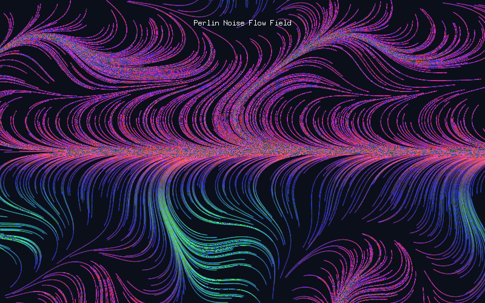
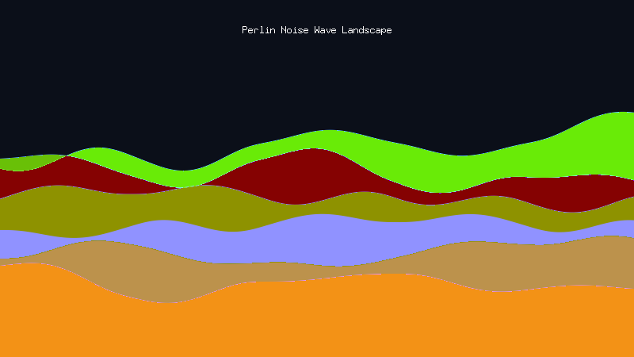
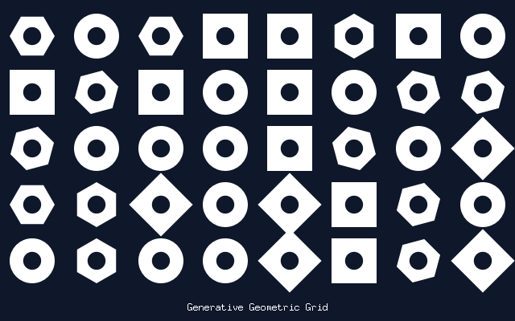

# Canvas

[](https://github.com/h8gi/canvas/actions/workflows/ci.yml)
[](https://pkg.go.dev/github.com/h8gi/canvas)

`canvas` is a lightweight, Processing-like 2D animation and creative coding library for Go.

It combines the power and simplicity of [`fogleman/gg`](https://github.com/fogleman/gg) (2D vector drawing) with [`gopxl/pixel`](https://github.com/gopxl/pixel) for window management and real-time graphics rendering.

## Features

- **Simple & Intuitive**: Start animating with familiar `Setup` and `Draw` callbacks—no window or loop boilerplate.
- **Rich 2D Vector Drawing**: Full 2D vector graphics (shapes, paths, text, images, colors, and transformations) powered by [`gg`](https://github.com/fogleman/gg).
- **Interactive**: Built-in mouse and keyboard handling for interactive sketches, simulations, and creative coding.

## Installation

```sh
go get github.com/h8gi/canvas
```

## Quick Start

```go
package main

import (
	"github.com/h8gi/canvas"
	"golang.org/x/image/colornames"
)

func main() {
	c := canvas.NewCanvas(&canvas.CanvasConfig{
		Width:     640,
		Height:    400,
		FrameRate: 60,
		Title:     "Hello Canvas!",
	})

	c.Setup(func(ctx *canvas.Context) {
		ctx.Background(colornames.White)
		ctx.SetColor(colornames.Green)
		ctx.SetLineWidth(5)
	})

	c.Draw(func(ctx *canvas.Context) {
		ctx.Push()
		if ctx.IsMouseDragged {
			ctx.SetColor(colornames.Red)
		}
		ctx.DrawLine(ctx.Mouse.X, ctx.Mouse.Y, ctx.PMouse.X, ctx.PMouse.Y)
		ctx.Stroke()
		ctx.Pop()

		if ctx.IsKeyPressed(canvas.KeyUp) {
			ctx.Background(colornames.White)
		}
	})
}
```

## Showcase

| Perlin Flow Field | Noise Landscape | Generative Grid |
| :---: | :---: | :---: |
|  |  |  |

## Examples

Check the [examples](examples) directory for complete programs:

- [`drawline`](examples/drawline): Interactive mouse drawing and key interactions.
- [`flow-field`](examples/flow-field): Organic flow field particles using HSB color and Perlin noise.
- [`lifegame`](examples/lifegame): Conway's Game of Life simulation.
- [`noise-landscape`](examples/noise-landscape): Organic wave animation with Perlin noise.
- [`rotate-objects`](examples/rotate-objects): Coordinate system rotation and object transformations.
- [`static-art`](examples/static-art): Single-frame generative art using `NoLoop()`.
- [`text`](examples/text): Text rendering, time tracking, and frame rate display.

## Built With

- [gg](https://github.com/fogleman/gg) - 2D graphics library
- [pixel](https://github.com/gopxl/pixel) - 2D OpenGL game engine

## License

[MIT License](LICENSE) © 2019-2026 Hiroki Yagi (h8gi)


